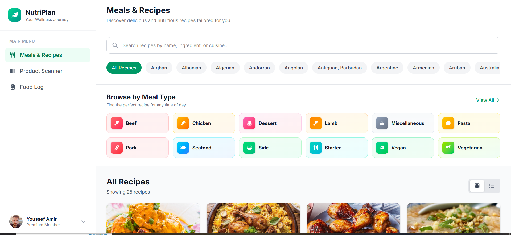

# 🥗 NutriPlan

A modern nutrition and meal planning web application that helps users discover healthy recipes, scan food products, and track their daily nutrition.

## 📸 Preview

## ✨ Features

* 🍽️ Browse healthy meals and recipes
* 🔍 Real-time recipe search
* 🏷️ Filter recipes by category and area
* 📖 View detailed recipe information
* 📱 Scan food products by barcode
* 🥣 Browse products by category
* ⭐ Filter products by Nutri-Score
* 📊 View complete nutrition facts
* 📝 Log meals to a daily food diary
* 💾 Save food log using Local Storage
* 📅 Weekly nutrition overview
* 📱 Fully responsive design

## 🛠️ Built With

* HTML5
* CSS3
* Tailwind CSS
* JavaScript (ES6)
* REST APIs

## 🚀 Live Demo

https://nada-mahrous.github.io/NutriPlan/

## 💻 Repository

https://github.com/nada-mahrous/NutriPlan.git
